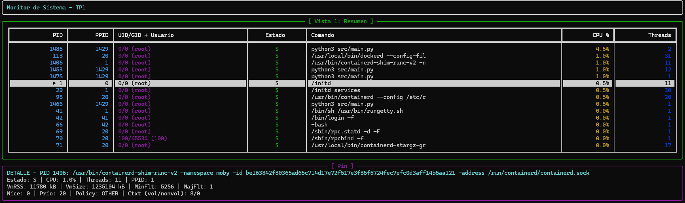
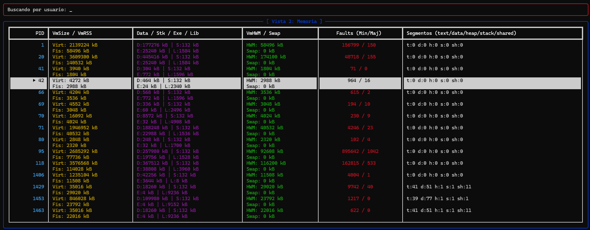
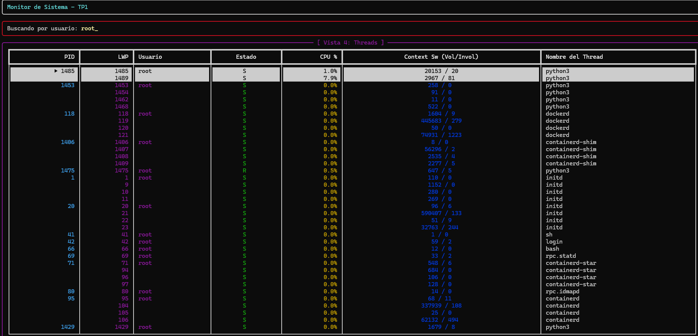
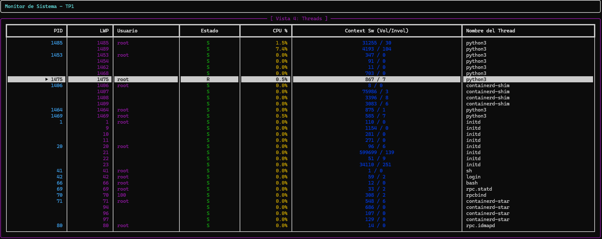
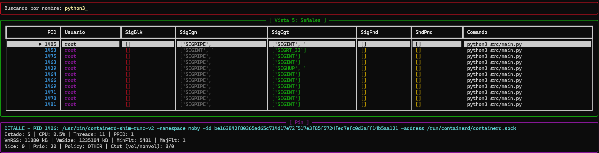
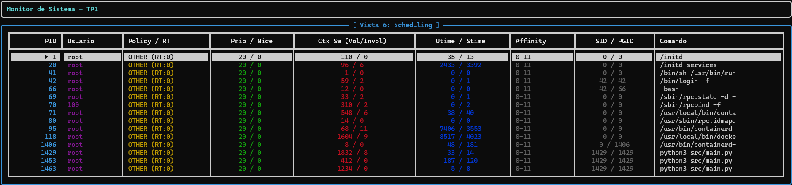
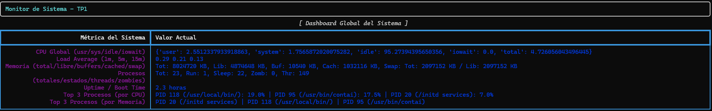
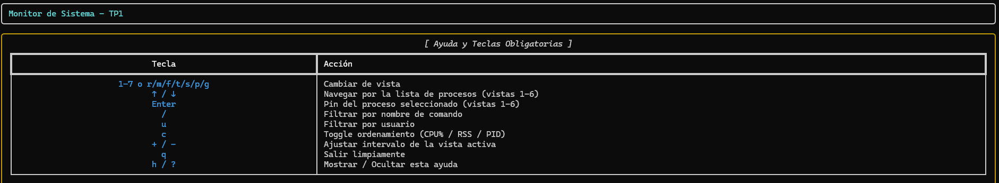

# Monitor de Procesos y Threads — TP1 Computación II

Monitor de sistema en tiempo real para Linux, similar a `htop` pero con foco en mostrar la **anatomía interna** de cada proceso (memoria, file descriptors, threads, señales, scheduling), leyendo `/proc` directamente — sin `psutil` ni herramientas equivalentes.

---

## 1. Descripción general

El monitor es un sistema **multiproceso**: un recolector central lista los PIDs vivos desde `/proc`, siete analizadores especializados (cada uno en su propio proceso, no thread) extraen una dimensión distinta de cada proceso, un snapshot en memoria compartida centraliza todo lo que se recolecta, y una interfaz de texto (TUI, con `rich`) muestra los datos con 7 vistas alternables.

Corre dentro de un contenedor Docker con `pid: "host"`, lo que le permite ver **todos** los procesos del sistema anfitrión (no solo los del contenedor), que es indispensable para que el monitor tenga sentido.

### Cómo se usa (resumen — instrucciones completas en la sección 6)

> ⚠️ Por una limitación de Docker Compose, `up` no adjunta el teclado (stdin) al contenedor — ver sección 5. Para interactuar con la TUI:
> ```bash
> docker compose run --rm monitor
> ```

### Controles

| Tecla | Acción |
|---|---|
| `1`–`7` o `r/m/f/t/s/p/g` | Cambiar de vista |
| `↑` / `↓` | Navegar la lista de procesos (vistas 1 a 6) |
| `Enter` | Pin/despin del proceso seleccionado (vistas 1 a 6) |
| `/` | Filtrar por nombre de comando |
| `u` | Filtrar por usuario |
| `c` | Rotar orden: CPU% → RSS → PID |
| `+` / `-` | Ajustar el intervalo de refresco de la vista activa |
| `q` | Salir limpiamente |
| `h` / `?` | Ayuda |

Mientras se está filtrando (`/` o `u`), cualquier tecla se toma como texto del filtro — se confirma con **Enter** o se cancela con **Esc**.

---

## 2. Diagrama de arquitectura

```
┌───────────────────────────────────────────────────────────────────┐
│  main.py — proceso padre                                          │
│  self-pipe (os.pipe) + select() ← recibe SIGINT/TERM/HUP/USR1/USR2│
│  crea y controla el ciclo de vida de todos los procesos hijos     │
└──────────────────────────────┬──────────────────────────────────┘
                                │ multiprocessing.Process(...)
     ┌───────────┬─────────────┼─────────────┬────────────┬─────────────┬─────────────┬────────────┐
     ▼           ▼             ▼             ▼            ▼             ▼             ▼            ▼
recolector    resumen       memoria         fds        threads       señales      scheduling     sistema
 (1s fijo)   (Value 2s)    (Value 3s)    (Value 5s)   (Value 2s)   (Value 10s)   (Value 10s)    (Value 2s)
     │           │             │             │            │             │             │            │
     └───────────┴─────────────┴─────────────┴────────────┴─────────────┴─────────────┴────────────┘
                                               │ cada uno escribe SOLO su propia clave
                                               ▼
     ┌─────────────────────────────────────────────────────────────────────────────────────────┐
     │  snapshot = multiprocessing.Manager().dict()   (corre en un proceso Manager aparte)      │
     │  claves: pids_activos, resumen, memoria, fds, threads, senales, scheduling, globales,     │
     │          config_filtro, config_revision                                                   │
     └─────────────────────────────────────┬───────────────────────────────────────────────────┘
                                            │ lee cada refresh (Live, refresh_per_second=4)
                                            ▼
                                   ┌───────────────────┐
                                   │  display_worker    │ ◄── teclado leído directo de /dev/tty
                                   │  (TUI con rich)     │
                                   └───────────────────┘

  Memoria compartida liviana (multiprocessing.Value — no pasa por el proceso Manager):
  - intervalo_<analizador>: uno por analizador, tipo 'd' (double). Lo escriben SIGHUP y las teclas +/-;
    lo lee cada worker en su propio time.sleep().
  - verbose_flag ('b'): toggleado por SIGUSR2, leído por display y por las tablas de FDs/Threads.
  - seguir_corriendo ('b'): puesto en 0 por main al recibir SIGINT/SIGTERM; los 8 workers lo chequean
    en la condición de su while para cortar su loop de forma prolija.
```

**Por qué esta forma y no otra:** el diagrama de la consigna sugiere un recolector que "distribuye trabajo" a los analizadores, lo cual sugiere un modelo de tipo *push* (por ejemplo, con `Queue`). Elegí en cambio un modelo *pull*: el recolector publica la lista de PIDs en `snapshot['pids_activos']`, y los 7 analizadores la leen de forma independiente en cada ciclo. La razón es que acá hay **múltiples consumidores necesitando el mismo dato repetidamente** (los 7 analizadores, en cada uno de sus ciclos), no una tarea que deba consumirse una sola vez por un solo worker. Una `Queue` está pensada justamente para lo segundo — cada ítem se consume una vez, por un solo lector — así que hubiéramos necesitado 7 colas separadas (una por analizador) recibiendo una copia cada una, mucho más complejo que una clave compartida que todos pueden leer sin consumirla.

---

## 3. Decisiones de diseño argumentadas

### 3.1 ¿Por qué procesos (`multiprocessing.Process`) y no threads?

La consigna lo exige y hay una razón de fondo para eso: en Python, el **GIL** (Global Interpreter Lock) impide que dos threads ejecuten bytecode Python al mismo tiempo, incluso en una máquina con varios cores — así que 7 threads leyendo y parseando texto de `/proc` en paralelo no se ejecutarían realmente en paralelo, solo se turnarían el único core lógico que el GIL permite usar a la vez. `multiprocessing.Process`, en cambio, crea procesos del sistema operativo reales (via `fork()` en Linux), cada uno con su propio intérprete de Python y, por lo tanto, sin GIL compartido entre ellos — ahí sí hay paralelismo real en múltiples cores.

### 3.2 ¿Por qué `Manager.dict` para el snapshot, y `Value` para los intervalos y flags?

La diferencia de fondo es que `Value`/`Array` viven directamente en memoria compartida vía `mmap` — acceso casi directo, sin intermediarios — mientras que `Manager` levanta **un proceso aparte** que mantiene las estructuras reales, y todos los demás procesos hablan con él por IPC (un socket interno). Eso hace que `Manager` sea más lento por operación, pero permite compartir objetos Python arbitrarios (dicts anidados, listas), cosa que `Value`/`Array` no pueden — solo manejan tipos primitivos de C (`int`, `double`, `char`...).

En este proyecto:
- El **snapshot** necesita guardar estructuras complejas y heterogéneas por vista: listas de diccionarios (FDs, threads por proceso), diccionarios anidados (memoria, scheduling por PID), listas de strings (top 3 por CPU/RAM). Eso es exactamente el caso de uso de `Manager.dict`.
- Los **intervalos** (`intervalo_resumen`, `intervalo_memoria`, etc.) y los **flags** (`verbose_flag`, `seguir_corriendo`) son un único número o un booleano, leídos en cada iteración de 8 procesos distintos (potencialmente varias veces por segundo). Ahí la velocidad de `Value` importa, y no hay ninguna estructura compleja que compartir — es el caso de uso exacto de `Value`.

### 3.3 ¿Cómo se manejaron las race conditions?

Dos estrategias distintas, según el caso:

**Para el snapshot (`Manager.dict`):** cada uno de los 7 analizadores escribe **exclusivamente** su propia clave (`resumen` solo lo escribe `resumen_worker`, `memoria` solo `memoria_worker`, etc.). Como nunca hay dos procesos escribiendo la misma clave al mismo tiempo, no hay una race condition de escritura-escritura posible ahí. Sí hay lecturas de claves ajenas (por ejemplo, `sistema_worker` lee `resumen` y `threads` para calcular los totales globales, o `display` lee todo para renderizar) — pero como son solo lecturas y el `Manager` serializa cada `get`/`set` individual a través de su proceso interno, cada operación puntual es atómica; lo único que no está garantizado es que una *lectura combinada* de varias claves (por ejemplo, leer `resumen` y después `memoria` en dos llamadas separadas) refleje exactamente el mismo instante — podría leer un `resumen` un poquito más nuevo que la `memoria`. Para un monitor en tiempo real con refrescos de 1-2 segundos, esa inconsistencia de milisegundos es aceptable y no afecta la corrección de lo que se muestra.

**Para los `Value` compartidos (intervalos y flags):** acá sí hay más de un proceso que puede *escribir* el mismo valor — por ejemplo, `main` (por `SIGHUP`) y `display` (por `+`/`-`) podrían, en teoría, escribir el mismo `intervalo_<analizador>` casi simultáneamente. Todas las escrituras a estos `Value` están protegidas con `with valor.get_lock():`, que es el patrón exacto que se ve en la clase de multiprocessing avanzado para prevenir que dos escrituras se pisen. Las *lecturas* (`intervalo_compartido.value` dentro del `time.sleep()` de cada worker) se hacen sin lock — es una lectura de una sola palabra de memoria, no una operación compuesta, así que en el peor caso un worker usa un valor "un ciclo viejo" del intervalo, nunca un dato corrupto.

Un caso especial: `snapshot['config_revision'] = snapshot.get('config_revision', 0) + 1` en `main.py`, al recibir `SIGHUP`, es un "leer-y-escribir" que **no** es atómico como operación compuesta. Pero acá no hace falta protegerlo con nada extra: `config_revision` solo lo escribe `main`, y `main` procesa las señales una por una en su loop principal (nunca dos señales al mismo tiempo) — no hay ningún otro proceso escribiendo esa clave, así que no hay con quién competir.

### 3.4 ¿Por qué esos intervalos por defecto?

Los valores (Resumen 2s, Memoria 3s, FDs 5s, Threads 2s, Señales 10s, Scheduling 10s, Sistema 2s) son los que sugiere la propia consigna, y la razón detrás tiene sentido con qué tan rápido cambia cada dato: CPU%, estado de proceso y estadísticas globales cambian todo el tiempo, así que necesitan refresco rápido (2s). Los FDs y la memoria cambian más lento (un proceso no abre/cierra archivos ni reserva memoria constantemente), así que 3-5s alcanza. Las máscaras de señales y los parámetros de scheduling (policy, nice, afinidad) casi nunca cambian en la mayoría de los procesos — refrescarlos cada 10s evita recorrer `/proc` de todos los procesos innecesariamente seguido, sin perder información relevante.


## 4. Conceptos del curso aplicados

> Para detectar **zombies** en la vista Sistema, uso el campo `estado` que parseo del campo 3 de `/proc/<pid>/stat` en `resumen.py`, y lo cuento en `sistema.py` con `if estado == "Z": zomb += 1`. Este concepto se vio en clase 4 (fork, exec, wait), cuando vimos que un zombie es un proceso terminado cuyo padre todavía no llamó a `wait()`.

> Para crear los 9 procesos del sistema (recolector, 7 analizadores, display), uso `multiprocessing.Process`, que en Linux usa `fork()` por debajo. Este concepto se vio en clase 4 (fork/exec/wait) y se retomó en clase 8 (multiprocessing envuelve fork): gracias a Copy-on-Write, cada `p.start()` es rápido porque no copia físicamente toda la memoria del padre hasta que alguno de los dos la modifica.

> Para clasificar los file descriptors de cada proceso en la vista FDs, recorro `/proc/<pid>/fd/` y uso `readlink` sobre cada entrada para ver a qué apunta (pipe, socket, dispositivo, archivo, inodo anónimo). Este concepto se vio en clase 5 (pipes), donde aprendimos que en UNIX casi todo se representa como un file descriptor y que `readlink` sobre `/proc/<pid>/fd/N` es la forma de averiguar qué hay detrás de cada uno.

> Para que `main.py` pueda esperar señales sin bloquearse ni perder ninguna, uso el patrón self-pipe: `senales.py` crea un pipe con `os.pipe()` y registra `signal.set_wakeup_fd(pipe_w)`, y el loop principal hace `select()` sobre el extremo de lectura. Este concepto se vio en clase 6 (señales), donde vimos que un handler de señal debe ser async-signal-safe y que la forma más segura de coordinar señales con un loop principal es que el handler no haga nada por sí mismo (nuestro `manejador_vacio`) y que todo el trabajo real ocurra afuera, cuando el loop principal detecta el byte en el pipe.

> Para compartir los intervalos de refresco (`intervalo_resumen`, etc.), el flag de verbose y la bandera de apagado (`seguir_corriendo`) entre los 9 procesos, uso `multiprocessing.Value`. Este concepto se vio en clase 7 (mmap y memoria compartida) y se retomó en clase 9 (multiprocessing avanzado): `Value` es un wrapper de memoria compartida vía `mmap` pensado para datos simples (un número, un flag), mucho más liviano que pasar por un proceso Manager.

> Para compartir el `snapshot` (los datos de las 7 vistas, que son diccionarios anidados y listas, no tipos simples) entre los 9 procesos, uso `multiprocessing.Manager().dict()` en vez de `Value`/`Array`. Este concepto se vio en clase 9, donde aprendimos la regla: si necesitás velocidad y son datos simples, `Value`/`Array`; si necesitás compartir estructuras Python complejas, `Manager` (que arranca un proceso aparte y habla con los demás por IPC).

> Para mandarle una señal a todo un grupo de procesos a la vez (por ejemplo, si quisiera reproducir cómo Ctrl+C afecta a todos mis workers en una sola llamada), la primitiva es `os.killpg(pgid, señal)`. Este concepto se vio en clase 6 (señales): el PGID agrupa procesos relacionados para que reciban señales en conjunto, que es justo lo que explica por qué un Ctrl+C en la terminal apaga mi `main.py` y a mis 8 procesos hijos aunque yo solo le haya mandado la señal a la terminal, no a cada uno.

> Para distinguir procesos de threads en mi output, uso el PID (`/proc/<pid>/`) en `resumen.py` y el TID (`/proc/<pid>/task/<tid>/`) en `threads.py`. Este concepto se conecta con la clase 3 (fundamentos de procesos) y la clase 10 (threading): el PID identifica al proceso, el TID a cada hilo (LWP) dentro de él, y el thread principal siempre tiene TID igual al PID.

---

## 5. Limitaciones conocidas

- **`docker compose up --build` no recibe el teclado.** Es una limitación de Docker Compose (`up` no adjunta stdin al contenedor, ni siquiera con un solo servicio y `tty`/`stdin_open` en `true`) — no es un bug del programa. Para usar la TUI de forma interactiva hay que usar `docker compose run --rm monitor`, que sí adjunta stdin/stdout/tty (equivalente a `docker run -it`).
- **No hay supervisor que reinicie un analizador caído.** Si a un analizador se le manda `kill -9`, ese proceso muere y su parte del snapshot (esa vista puntual) queda "congelada" con el último dato bueno — el resto del sistema (las otras 6 vistas, el recolector, el display) sigue funcionando con normalidad. `main.py` no detecta ni reinicia analizadores muertos.
- **El panel de detalle del proceso pineado no cambia según la vista activa.** Muestra siempre la misma combinación de datos (resumen + memoria + scheduling), sin importar en qué vista esté parado el usuario cuando lo mira. Es una simplificación deliberada frente a la idea de un "panel de detalle que cambia según la vista".
- **Resolución de usuario (UID → nombre).** Como el contenedor usa `pid: "host"` pero no comparte `/etc/passwd` con el host, un UID del sistema anfitrión puede no tener nombre en el contenedor — en esos casos se muestra el número de UID en vez del nombre.

---

## 6. Cómo correr y testear

### Levantar el monitor

```bash
git clone <url-del-repo>
cd <repo>
docker compose up --build
```

Para poder usar el teclado (obligatorio para navegar la TUI):

```bash
docker compose run --rm monitor
```

### Probar las señales

Con el monitor corriendo, en otra terminal:

```bash
docker ps                                          # ver el nombre/ID del contenedor
docker kill --signal=SIGUSR1 <contenedor>           # dump del snapshot
docker kill --signal=SIGUSR2 <contenedor>           # toggle modo verbose
docker kill --signal=SIGHUP  <contenedor>           # recargar config.json
docker kill --signal=SIGTERM <contenedor>           # shutdown limpio
```

- **`SIGUSR1`**: revisá que se haya creado `dump_<timestamp>.json` en la carpeta del proyecto (aparece ahí directo gracias al volumen montado) y que sea JSON válido: `python3 -m json.tool dump_<...>.json`.
- **`SIGUSR2`**: pasate a la vista de FDs o Threads (`3` o `4`) antes de mandar la señal — deberías ver más filas por proceso.
- **`SIGHUP`**: editá `config.json` (por ejemplo, cambiá un intervalo o `filtro_default`), guardá, mandá la señal, y confirmá que el cambio se refleja sin reiniciar el contenedor.
- **`SIGTERM`/`SIGINT`**: el contenedor debería cerrarse solo, sin quedar colgado.

### Requisitos

- Python 3.11+ (usado dentro del contenedor)
- Docker + Docker Compose
- Sin dependencias externas más que `rich` (ver `requirements.txt`)

---

## 7. Capturas de pantalla










---

8. Decisiones sobre la TUI

Arranqué probando curses para la TUI, pero después de pelear con su manejo de bajo nivel (posicionamiento de cursor a mano, refresco manual de pantalla) cambié a rich, y en retrospectiva terminó siendo la mejor decisión para este TP: Live maneja el refresco de pantalla y el doble buffer automáticamente, Layout permite dividir la pantalla en regiones con nombre (cabecera/cuerpo/footer) sin manejar coordenadas a mano, y Table/Panel dan formato con color y bordes sin tener que dibujar caracteres uno por uno. 

(Aclaración honesta: el problema de que el teclado no respondía con docker compose up — que en su momento pensé que era culpa de curses — en realidad no tenía nada que ver con la librería de TUI.)

9. Lo que aprendí

Una de las cosas que más me costó entender fue el tema de docker compose up vs run. Al principio había elegido curses para hacer la TUI, pero al no poder usar el teclado pensé que era un problema de curses, así que cambié a rich — y me encontré con el mismo problema. Al hablar con compañeros supe que a ellos les pasaba lo mismo, así que decidí usar docker compose run en su lugar, aunque no siga la consigna al pie de la letra.

A lo largo de estos días fui terminando de entender lo visto en clase al irlo experimentando en la práctica mientras hacía el trabajo, y entendí cosas que no había terminado de cerrar durante el cursado, como el manejo de señales desde otra terminal, el uso de Docker y su importancia, y los procesos de cada analizador y el tiempo que tarda cada uno. También pude resolver varios problemas con ayuda de la IA, lo que me sirvió para seguir aprendiendo a usar esta herramienta. Y lo más importante: aprender cómo es realmente la arquitectura completa, y terminar de ver la conexión entre las distintas partes y cuál es el trabajo de cada una.


*Computación II — TP1 — Universidad de Mendoza — 2026*